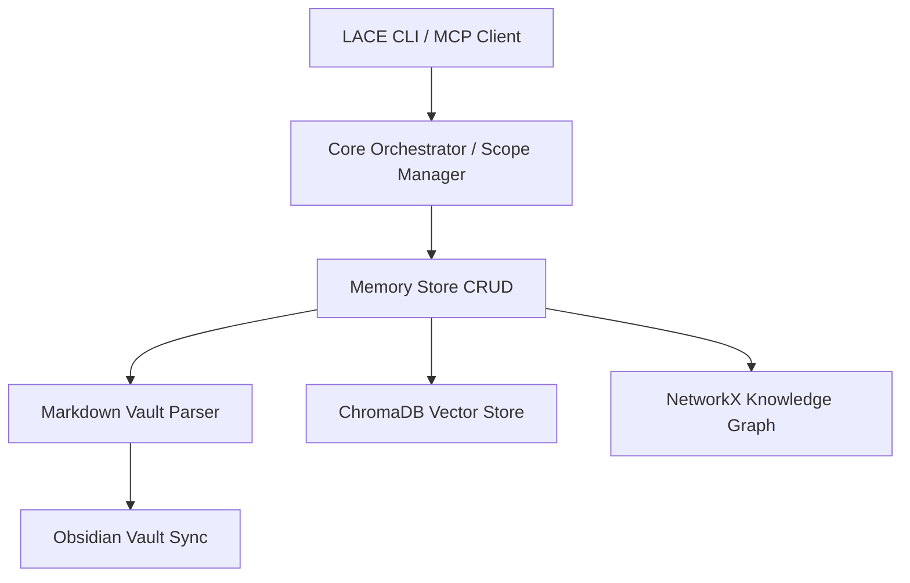

# LACE (Local AI Context Engine)

[](https://www.python.org/)
[](https://opensource.org/licenses/MIT)

**LACE (Local AI Context Engine)** is a persistent, semantic memory and local context orchestration engine for your AI tools and agents. It stores memories as human-readable Markdown notes in a local vault, indexes them using local vector embeddings, and links them into a semantic knowledge graph. With built-in bidirectional Obsidian sync and a Model Context Protocol (MCP) server, LACE acts as a unified long-term memory layer for any AI tool you use.

---

## Key Features

* **Persistent Local Memory**: Stored as human-readable Markdown files (`~/.lace/memory/vault`) and indexed with ChromaDB.
* **Context-Aware Scoping**: Manage memories across multiple scopes—**Global**, **Project-specific** (auto-detected via Git trees), and **Ephemeral Session** scopes.
* **5-Signal Retrieval & Ranking**: Uses a composite relevance score `[0.0 - 1.0]` combining:
  * Semantic Similarity (ChromaDB vector distance)
  * Recency Decay (time-based relevance halving)
  * Access Frequency (log-scale frequency boosting)
  * Confidence Ratings (user-supplied helpfulness/feedback)
  * Scope-Matching Bonus (preferring current project/session memories)
* **Smart Deduplication & Merging**: Evaluates similarity during ingestion:
  * **> 95% similarity**: Skips saving to avoid bloating.
  * **85% - 95% similarity**: Automatically merges content and tags into the existing memory note.
  * **< 85% similarity**: Stores as a new memory.
* **Bidirectional Obsidian Sync**: Real-time sync between your LACE memory vault and your personal Obsidian vault, tracking modification times (`mtime`) and resolving conflicts gracefully.
* **Knowledge Graph & Wikilink Injection**: Compiles a concept network using NetworkX and automatically injects Obsidian-style `[[wikilinks]]` into related notes.
* **Model Context Protocol (MCP) Support**: Exposes LACE memories directly to compatible LLM clients (such as Claude Desktop or Cursor) as tools using the MCP stdio protocol.

---

## Installation & Setup

LACE uses Python `hatchling` for packaging and is best managed using `uv`.

### 1. Prerequisites
- Python `>= 3.11`
- [uv](https://github.com/astral-sh/uv) (recommended) or `pip`

### 2. Install LACE
Clone the repository and install it in editable/development mode:

```bash
git clone https://github.com/AayushM0/lace.git
cd lace
uv pip install -e .
```

Alternatively, run commands directly through `uv run`:
```bash
uv run lace --help
```

### 3. Initialize LACE
Set up the default home directories and default config file (`~/.lace/config/lace.yaml`):

```bash
lace init
```

To initialize LACE in a custom home directory:
```bash
lace init --home /path/to/custom/dir
```

---

## Quick Start

A basic workflow showing how to use LACE to remember, search, and recall context:

### 1. Add a Memory
Manually save context with tags, category, and scope:
```bash
lace memory add "I am building a web app using FastAPI and Svelte." --tag fastapi --tag svelte --category tech-stack
```

### 2. Search Memories
Perform a semantic search across your memory vault:
```bash
lace memory search "what is my web app stack?" --scores
```

### 3. Ask the LLM (with context injection)
Query the configured LLM client. LACE will fetch relevant memories, inject them as context, and stream the response:
```bash
lace ask "Write a template setup for my web app project" --show-context
```

---

## Configuration

The configuration is saved in `~/.lace/config/lace.yaml`. You can modify it directly or use the CLI:

```bash
# View current config parameters
lace config show

# Set LLM provider to openai
lace config set provider.default "openai"

# Adjust retrieval weights
lace config set retrieval.weights.semantic_similarity 0.50
lace config set retrieval.weights.recency 0.15
```

### Configuration Fields
* **`memory`**: Controls deduplication, confidence extraction thresholds, and decay half-life.
* **`retrieval`**: Defines the relevance threshold for search and the weights of the 5 signals (must sum to `1.0`).
* **`embeddings`**: Selects the vector embeddings provider (`local` / `openai`) and model (e.g., `all-MiniLM-L6-v2`).
* **`provider`**: Configuration for Ollama, OpenAI, and Anthropic LLM clients.

---

## CLI Command Reference

### System & Configuration
| Command | Description |
| :--- | :--- |
| `lace init [--home <PATH>]` | Initialize LACE home directories and default config |
| `lace version` | Print current LACE package version |
| `lace config show` | View current configurations |
| `lace config set <key> <value>` | Set a configuration value using dot notation |

### Project & Scope Management
| Command | Description |
| :--- | :--- |
| `lace project create <name>` | Create a project scope file |
| `lace project list` | List all project scopes |
| `lace project switch <name>` | Manually switch active project scope |
| `lace project info` | View metadata of the active scope |
| `lace project detect` | Auto-detect scope based on active Git tree |

### Ephemeral Sessions
| Command | Description |
| :--- | :--- |
| `lace session start` | Begin an ephemeral session-scoped memory tree |
| `lace session info` | Print current session identifier |
| `lace session stop` | Stop active session and restore default scope |

### Memory CRUD & Search
| Command | Description |
| :--- | :--- |
| `lace memory add "<content>"` | Add a new memory with tags and category |
| `lace memory list` | View table of active memories |
| `lace memory show <id>` | View contents and YAML metadata of a memory note |
| `lace memory forget <id>` | Archive a memory note (retains file, skips retrieval) |
| `lace memory search <query>` | Query memories semantically with scoring |
| `lace memory reindex` | Re-embed all notes in ChromaDB |
| `lace memory stats` | View latency, quality, and storage stats |
| `lace memory rate <id> <score>` | Adjust confidence rating (`helpful`, `outdated`, `wrong`) |
| `lace memory review` | Start interactive review of low-confidence notes |

### Obsidian Integration & Graph
| Command | Description |
| :--- | :--- |
| `lace vault sync` | Perform bidirectional sync with Obsidian vault |
| `lace vault watch` | Start real-time file system monitoring of Obsidian vault |
| `lace vault status` | Check sync tracking stats |
| `lace graph build` | Construct NetworkX graph from Markdown files |
| `lace graph stats` | Display graph node and edge distributions |
| `lace graph related <concept>` | Traverse the graph network using Breadth-First Search |
| `lace wikilink inject` | Inject related wikilinks (`[[concept]]`) into notes |

---

## Architecture & Internal Workflows

For a detailed technical dive into the system modules, design schemas, and background workflows (deduplication, retrieval, sync, and graph traversal), refer to the [Architecture Document](file:///home/aayush-mittal/everything/projects/lace/architecture.md).



---

## Development & Testing

LACE uses `pytest` for unit and integration testing.

Run all tests:
```bash
uv run pytest
```

Check code coverage or run tests on specific modules:
```bash
uv run pytest tests/test_core/
uv run pytest tests/test_memory/
```

---

## License

This project is licensed under the MIT License - see the `LICENSE` file for details.
