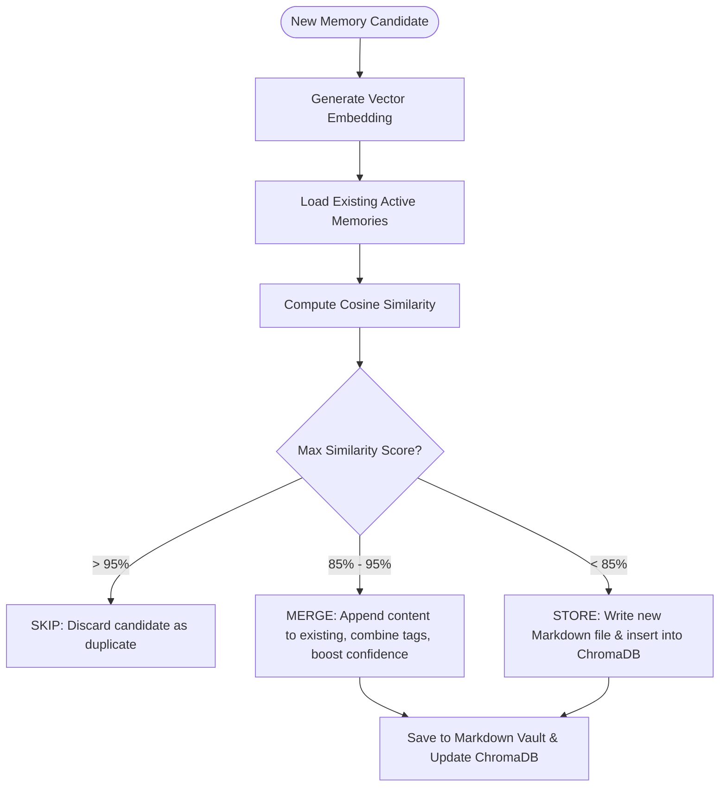
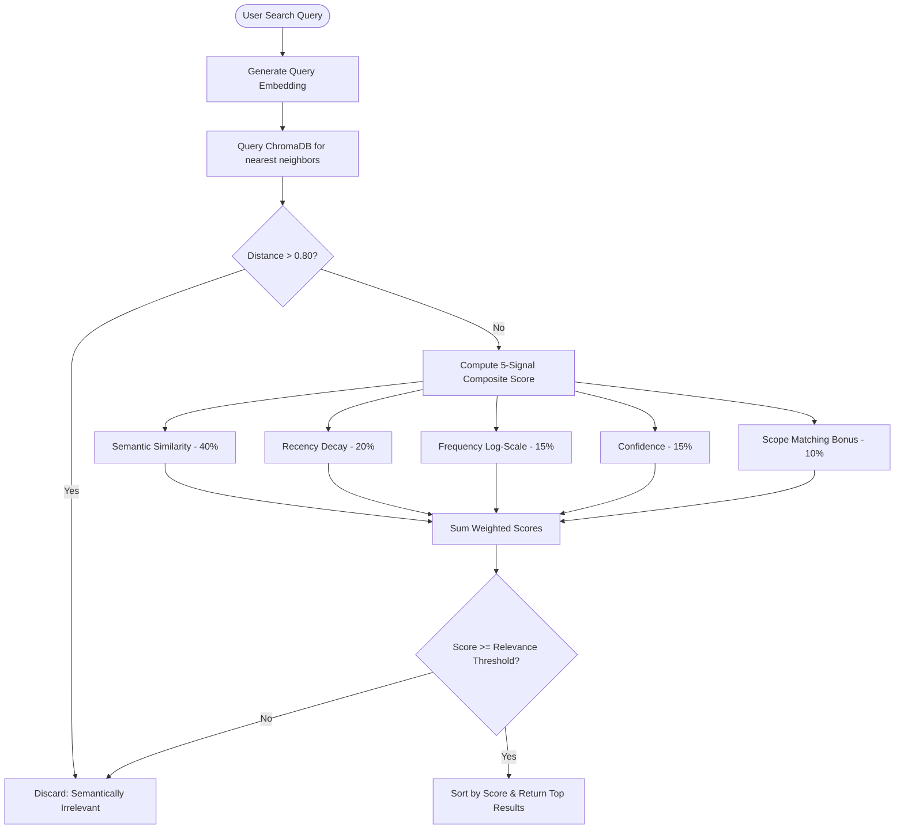
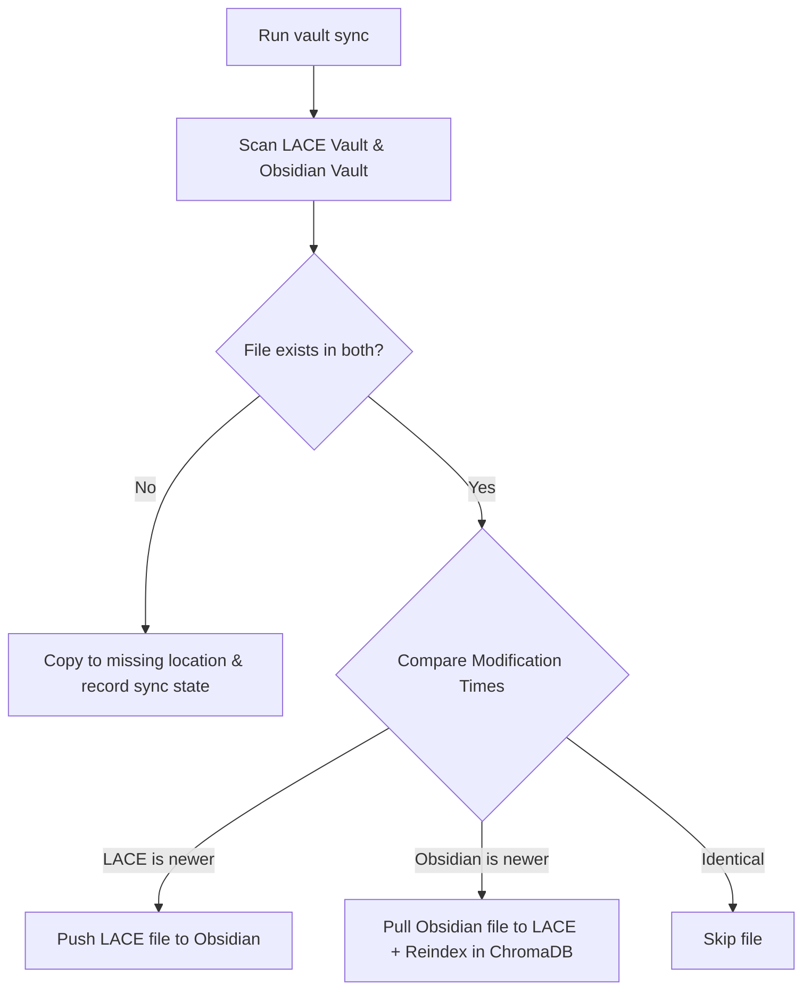

# LACE (Local AI Context Engine) Architecture & Technical Reference

This document provides a comprehensive overview of LACE's design, code architecture, directory structure, internal workflows, and command reference.

---

## 1. Directory & Code Structure

LACE is structured as a modular Python package using `hatchling` for packaging and `uv` for dependency management.

```text
lace/
├── pyproject.toml                 # Dependencies, package metadata, CLI entrypoints
├── src/
│   └── lace/
│       ├── main.py                # Typer CLI application entry point (defines all subcommands)
│       ├── core/                  # Core orchestration & session/project scoping
│       │   ├── config.py          # Configuration schema (pydantic), config save/load, initialization
│       │   ├── engine.py          # GraphManager orchestration
│       │   ├── identity.py        # Compiles user identity & preference files to system prompts
│       │   └── scope.py           # Scope management (global, project, session) & Git detection
│       ├── memory/                # Memory CRUD operations & vault interface
│       │   ├── store.py           # MemoryStore CRUD orchestrator (vector + markdown)
│       │   ├── models.py          # MemoryObject & RetrievalResult dataclasses and Enums
│       │   ├── markdown.py        # Markdown parser/serializer for vault files (handles YAML frontmatter)
│       │   ├── extractor.py       # LLM extraction pipeline (prompts, parsers, character gates)
│       │   └── dedup.py           # Deduplication engine (cosine similarity checks)
│       ├── retrieval/             # Search, embeddings, and ranking algorithms
│       │   ├── embeddings.py      # HuggingFace sentence-transformers & local cache management
│       │   ├── vector.py          # ChromaDB client & multi-scope collection management
│       │   └── ranking.py         # Multi-signal ranking algorithm (semantic, recency, frequency, scope)
│       ├── vault/                 # File synchronization & directory watching
│       │   ├── state.py           # SyncState persistence (tracks mtime of vault vs Obsidian)
│       │   ├── sync.py            # Bidirectional vault sync file copy logic
│       │   └── watcher.py         # Watchdog-based real-time file system monitoring
│       ├── graph/                 # Knowledge Graph & Obsidian wikilinks
│       │   ├── graph.py           # NetworkX graph build, save, load, and stats helper
│       │   ├── wikilinks.py       # Injector for [[wikilinks]] based on graph relationships
│       │   ├── parser.py          # In-text wikilink regex extractor
│       │   └── traversal.py       # Hop-based neighbor finder (breath-first search)
│       └── utils/                 # General utilities
│           ├── ask.py             # Ask engine (prompt compiler + LLM streaming query runner)
│           ├── providers.py       # LLM provider clients (Ollama, OpenAI, Anthropic)
│           ├── logging.py         # Latency, search terms, and interaction logger
│           └── tokens.py          # Token estimator & truncation helper
└── tests/                         # Pytest test suites matching the package modules
```

---

## 2. Core Workflows (Behind-the-Scenes)

### 2.1 Memory Storage & Deduplication Workflow
When a new memory is created (manually, via MCP `remember`, or via LLM `auto_extract`), it goes through the following deduplication pipeline to prevent cluttering:



---

### 2.2 Multi-Signal Retrieval & Ranking Workflow
LACE does not rely on simple vector distance. It evaluates five separate signals to calculate a composite relevance score `[0.0 - 1.0]` for each candidate:



---

### 2.3 Vault Bidirectional Sync Workflow
The vault sync handles replication between LACE's internal vault (`~/.lace/memory/vault`) and your Obsidian vault. It preserves local modification times to detect edits:



---

### 2.4 Knowledge Graph & Wikilink Injection Workflow
Building the graph and injecting links connects memories semantically using `networkx`:

```mermaid
graph TD
    Start[Run graph build] --> Scan[Scan active Markdown memories]
    Scan --> Nodes[Add nodes: Memory Files & Concept Tags/Wikilinks]
    Nodes --> Edges[Add edges: tagged_with, links_to, co_occurs]
    Edges --> Graph[Save graph.json]
    
    Graph --> Wikilink[Run wikilink inject]
    Wikilink --> Analyze[Analyze graph 2-hop traversal]
    Analyze --> Filter{Find related concepts that are NOT direct tags?}
    Filter -->|Yes| Inject[Append **Related:** [[concept]] to Note body]
    Filter -->|No| Skip[Skip Note]
```

---

## 3. Configuration Schema

The LACE configuration is stored at `~/.lace/config/lace.yaml`. The schema is validated using Pydantic:

* **`memory`**:
  * `auto_extract` (bool): Enables background LLM extraction during queries.
  * `extraction_threshold` (float): Minimum confidence required to auto-store.
  * `require_confirmation` (bool): Prompts user before saving auto-extracted memories.
  * `dedup_threshold` (float): Similarity threshold for merging memories.
  * `decay_half_life_days` (int): Days after which a memory's recency score halves.
* **`retrieval`**:
  * `relevance_threshold` (float): Minimum composite score to include in search.
  * `max_results` (int): Maximum memories injected into LLM context.
  * `weights`: Dictionary mapping relative weight of `semantic_similarity`, `recency`, `frequency`, `confidence`, and `scope` (must sum to `1.0`).
* **`embeddings`**:
  * `provider` (str): `"local"` (sentence-transformers) or `"openai"`.
  * `model` (str): Embeddings model name (default: `"all-MiniLM-L6-v2"`).
* **`provider`**:
  * `default` (str): Active LLM client (`"ollama"`, `"openai"`, or `"anthropic"`).
  * Sub-configs for `ollama` (host, model, context window), `openai` (model, context window), and `anthropic` (model, context window).

---

## 4. CLI Subcommand Reference

### 4.1 System & Configurations
* `lace init [--home <PATH>]`: Sets up standard directories and configuration templates.
* `lace version`: Prints active LACE version.
* `lace config show`: Displays the flattened configuration table.
* `lace config set <key> <value>`: Updates parameters in `lace.yaml` using dot notation.

### 4.2 Project & Scope Management
* `lace project create <name> [--description <DESC>]`: Initializes project YAML file.
* `lace project list`: Lists all projects, descriptions, and last-used dates.
* `lace project switch <name>`: Switch the active context scope manually.
* `lace project info`: View properties of the active project scope.
* `lace project detect`: Auto-detects the project based on the current Git tree or workspace folders.

### 4.3 Ephemeral Sessions
* `lace session start`: Activates a temporary, session-scoped memory tree.
* `lace session info`: Prints the active session ID.
* `lace session stop`: Ends session and restores the default project/global scope.

### 4.4 Memory CRUD & Maintenance
* `lace memory add "<content>" [--tag <TAG>] [--category <CAT>] [--scope <SCOPE>] [--summary <SUM>]`: Store a manual memory.
* `lace memory list [--category <CAT>] [--scope <SCOPE>] [--archived] [--limit <N>]`: List memories in a table.
* `lace memory show <memory_id>`: Show full memory Markdown contents and metadata.
* `lace memory forget <memory_id> [-y]`: Archive a memory (removes it from retrieval, retains file).
* `lace memory search <query> [-n <limit>] [--scope <scope>] [--scores]`: Search memories semantically.
* `lace memory reindex`: Re-embeds all memories in the vault to reconstruct the vector store.
* `lace memory stats [--days <N>]`: Detailed quality, latency, and storage dashboard.
* `lace memory extract "<query>" "<response>"`: Run manual LLM-based memory extraction on a conversation turn.
* `lace memory rate <memory_id> <signal>`: Rates a memory as `helpful`, `outdated`, or `wrong` to adjust confidence.
* `lace memory review [-n <limit>]`: Run interactive review of low-confidence or unaccessed memories.

### 4.5 Obsidian Integration & Graph
* `lace vault sync [--vault <PATH>] [--no-reindex] [--dry-run]`: Bidirectional file sync.
* `lace vault watch [--vault <PATH>] [--interval <SEC>]`: Background watcher syncing files in real-time.
* `lace vault status`: Show sync tracking metrics.
* `lace wikilink inject`: Automatic graph-based wikilink insertion.
* `lace wikilink status`: See wikilink density statistics.
* `lace graph build`: Scan Markdown files and compile the NetworkX graph.
* `lace graph stats`: View graph node and edge counts.
* `lace graph related <concept> [-d <depth>] [--memories]`: BFS traversal showing related concept networks.
* `lace graph show <memory_id> [-d <depth>]`: Shows connections for a specific memory.

### 4.6 LLM Client & MCP Server
* `lace ask "<query>" [--show-context] [--no-memory] [--scope <scope>] [--provider <provider>]`: Retrieve context, build prompt, and query the LLM.
* `lace mcp start [--debug]`: Spins up the stdio JSON-RPC Model Context Protocol server.

### 4.7 Interaction Logging
* `lace logs show [--days <N>] [--limit <LIMIT>] [--type <TYPE>]`: Display search logs.
* `lace logs stats [--days <N>]`: Retrieval quality, average, and P95 latency metrics.
* `lace logs clear [--older-than <DAYS>] [-y]`: Clears historical log files.
