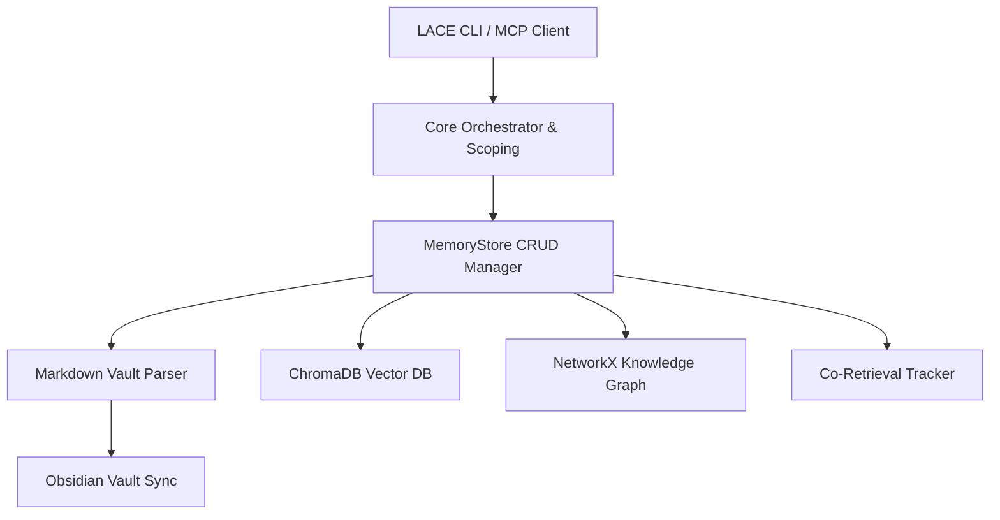

# LACE (Local AI Context Engine) — Product Requirements Document (PRD) & Technical Guide

LACE (Local AI Context Engine) is a local, persistent semantic memory and context orchestration engine built for AI developers and tools. It organizes memory in human-readable Markdown notes, indexes it using local vector embeddings, structures it with a NetworkX knowledge graph, and exposes it to LLMs through the Model Context Protocol (MCP) and a CLI.

---

## 1. Product Vision & Goals

### The Problem
AI agents and developers lose context across conversations. Existing memory layers are either non-persistent (relying on single-session history), proprietary cloud-hosted solutions, or too complex to set up.

### The Solution
LACE provides a local, secure, developer-controlled, and transparent long-term memory layer that:
1. **Stores data in human-readable formats** (Markdown notes + frontmatter in a local vault).
2. **Synchronizes bidirectionally with Obsidian** to allow direct human editing and visualization.
3. **Uses multi-signal retrieval** combining vector search, tag matching, graph traversals, and recency/frequency signals to rank relevant context.
4. **Performs background extraction** to learn from conversation turns without blocking the user interface.

---

## 2. System Architecture

The core of LACE consists of five layers:



### Directory Structure & Code Modules

- `src/lace/main.py`: Entry point for the Typer CLI application defining subcommands.
- `src/lace/core/`:
  - `config.py`: Defines the Pydantic schemas, config persistence (`~/.lace/config/lace.yaml`), and home directory initialization.
  - `scope.py`: Manages global, project-specific, and ephemeral session scopes. Detects active projects via Git tree roots or `.lace/project.yaml`.
- `src/lace/memory/`:
  - `store.py`: The central MemoryStore orchestrator, interfacing between Markdown files and retrieval engines.
  - `models.py`: Defines key data classes: `MemoryObject`, `RetrievalResult`, and Category/Source/Lifecycle enums.
  - `markdown.py`: Serializer and parser for markdown vault files containing YAML frontmatter.
  - `extractor.py`: The LLM-assisted knowledge extraction pipeline.
  - `dedup.py`: Simple cosine-similarity deduplication module.
- `src/lace/retrieval/`:
  - `unified.py`: Orchestrates multi-signal candidate pools (vector, tags, graph expansion, co-retrieval boost).
  - `ranking.py`: Composite ranking algorithm scoring candidate relevance based on semantic similarity, recency decay, frequency, confidence, and scope-matching.
  - `vector.py`: Local ChromaDB vector database interface.
  - `embeddings.py`: Wraps local HuggingFace `sentence-transformers` (defaulting to `all-MiniLM-L6-v2`) and OpenAI embedding endpoints.
- `src/lace/vault/`:
  - `sync.py`: Bidirectional file sync utility replication algorithm.
  - `watcher.py`: File watch implementation monitoring local markdown files.
- `src/lace/mcp/`:
  - `server.py`: Stdio JSON-RPC Model Context Protocol (MCP) server exposing tools.
  - `tools.py`: Tool call implementations (remembering, querying, retrieving context).
  - `queue.py`: Background SQLite-backed asynchronous extraction worker queue.

---

## 3. Core Features & Workflows

### 3.1 Memory Objects Schema
Memories are stored as markdown files (`~/.lace/memory/vault/<path>/<id>.md`) structured as follows:

```markdown
---
id: mem_a8b9c1d2e3f4
category: pattern
source: conversation
lifecycle: captured
confidence: 0.8
project_scope: project:LACE
tags:
  - mcp
  - sqlite
created_at: 2026-07-04T17:00:00Z
last_accessed: 2026-07-04T17:15:00Z
access_count: 5
related_ids:
  - mem_xyz789
summary: SQLite-backed queue design for MCP server
---

Memory body content goes here...
```

**Memory Categories**: `pattern`, `decision`, `debug`, `reference`, `preference`  
**Memory Lifecycle**: `captured`, `validated`, `consolidated`, `archived`  
**Memory Sources**: `conversation`, `user_correction`, `manual`, `ingestion`, `mcp`, `auto_extracted`

---

### 3.2 Ingestion & Deduplication Pipeline
When new content is added to LACE, it evaluates cosine similarity against existing memories:
- **Similarity > 95%**: Deemed a duplicate and discarded (**SKIP**).
- **Similarity 85% - 95%**: Automatically combined into the existing memory, tags are merged, confidence is boosted, and `last_accessed` is touched (**MERGE**).
- **Similarity < 85%**: Saved as a new markdown note in the vault and indexed in ChromaDB (**STORE**).

```text
               New Memory Candidate
                        │
             [Generate Vector Embedding]
                        │
          [Compute Cosine Sim vs Vault]
                        │
         ┌──────────────┼──────────────┐
         ▼              ▼              ▼
       > 95%        85% - 95%        < 85%
      [ SKIP ]       [ MERGE ]      [ STORE ]
```

---

### 3.3 Scopes: Multi-Tenant Context
LACE isolates memories to prevent context-pollution across projects:
1. **Global Scope**: Context that is universally helpful (e.g. general language preferences).
2. **Project Scope**: Autodetected by finding the nearest Git root or a `.lace/project.yaml` file. Writes notes to `vault/projects/<project_name>/`.
3. **Session Scope**: Temporary memory chains (inbox/session) that are deleted or restored when a session stops.

---

### 3.4 Multi-Signal Retrieval & Unified Scoring
Rather than pure vector distance matching, retrieval compiles a composite relevance score `[0.0 - 1.0]` based on:

| Signal | Relative Weight | Calculation Details |
| :--- | :--- | :--- |
| **Semantic Similarity** | 45% (or 40% classic) | ChromaDB cosine distance converted to similarity: `1 - (distance / 2)` |
| **Tag Matching** | 15% | Percentage of query keywords matching memory tags |
| **Graph Proximity** | 15% | Multi-hop NetworkX BFS path weight connecting related concepts |
| **Co-Retrieval Boost** | 10% | Learned usage patterns showing which notes are retrieved together |
| **Recency Decay** | 10% (or 20% classic) | Exponential half-life: `0.5 ^ (days_elapsed / 30)` |
| **Confidence & Scope** | 5% (or 15% / 10% classic) | Reflects developer ratings (helpful vs wrong) and project-scope match |

---

### 3.5 Asynchronous Conversation Extraction Queue
LACE tracks developer-AI interactions in real-time. To ensure instant responses, turns are queued in a background SQLite database (`~/.lace/queue/extraction_queue.db`) where a daemon worker thread extracts patterns, debug logs, or decisions asynchronously:

1. Agent calls `process_interaction(query, response)`.
2. Stored in SQLite (execution time `< 5ms`).
3. Background worker polls queue every 30 seconds.
4. LLM analyzes the query and response to extract actionable knowledge.
5. Filtered, deduplicated, and inserted into the vault or inbox.

---

### 3.6 Obsidian Bidirectional Sync
Tracks modified times (`mtime`) on all files inside LACE's vault and Obsidian's designated vault subfolder (`LACE/`):
- If LACE note is newer: Copies LACE file to Obsidian.
- If Obsidian note is newer: Pulls Obsidian file into LACE and re-indexes in ChromaDB.
- Files deleted or archived in LACE are removed from Obsidian.

---

## 4. MCP Tools & Resources Reference

The LACE MCP Server runs over `stdio` and implements:

### Tools
- `initialize_lace_session(working_directory)`: ALWAYS runs on conversation start. Detects the active project.
- `get_relevant_context(query)`: Runs at the start of every turn to fetch, rank, and inject memories as markdown text into the system context.
- `process_interaction(query, response)`: Runs at the end of every turn to queue interaction analysis for background extraction.
- `search_memory(query, scope, max_results)`: Manual search tool.
- `remember(content, category, tags)`: Manual ingestion tool.
- `list_memories()`: Browsing tool.
- `forget_memory(memory_id)`: Archives a memory.
- `get_related_concepts(concept)`: Traverses the knowledge graph to return neighbor notes.

### Resources
- `memory://patterns`: Stored patterns markdown resource.
- `memory://decisions`: Architectural decisions markdown resource.
- `memory://project-context`: Active project rules and context.
- `memory://debug-log`: Resolved bugs and solutions.
- `memory://instructions`: LACE memory protocol instructions.

---

## 5. Current Implementation Status & Health

- **Code Structure**: High quality, modular, type-hinted code. Robust tests mirror the source modules.
- **Environment Integration**: Integrates directly with CLI (`lace` command built with Typer) and stdio JSON-RPC clients (via the `mcp` library).
- **Embedded Database**: Successfully uses a local SQLite queue DB for extraction and local ChromaDB files for vector indices.
- **Obsidian Sync**: Fully operational with Watchdog watcher logic.
